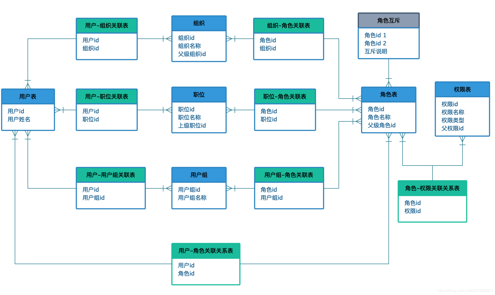

# space-init

#### 一、介绍
极简

#### 二、软件架构
软件架构说明


#### 三、安装教程

1.  xxxx
2.  xxxx
3.  xxxx

#### 四、使用说明

1.  xxxx
2.  xxxx
3.  xxxx


#### 五、模型设计


权限模型设计

```bash
1、ACL 访问控制列表
定义：规定资源可以被哪些主体进行哪些操作。
在ACL权限模型下，权限管理是围绕资源来设定的。我们可以对不同的页面设定可以访问的用户


2、DAC 自主访问控制
定义：规定资源可以被哪些主体进行哪些操作。同时，主体可以将资源、操作的权限，授予其他主体
在ACL的基础上，DAC模型将授权的权力下放，允许拥有权限的用户，可以自主地将权限授予其他用户。


3、MAC 强制访问控制
定义：当一个操作，同时满足a与b时，允许操作:
	a. 规定资源可以被哪些类别的主体进行哪些操作
	b. 规定主体可以对哪些等级的资源进行哪些操作 
MAC是ACL的另一种实现，强调安全性。MAC会在系统中，对资源与主体，都划分类别与等级。比如，
	等级分为：秘密级、机密级、绝密级；
	类别分为：军事人员、财务人员、行政人员。
MAC的优势就是实现资源与主体的双重验证，确保资源的交叉隔离，提高安全性。


4、RBAC 基于角色的访问控制
定义：当一个操作，同时满足a与b时，允许操作:
	a. 规定角色可以对哪些资源进行哪些操作
	b. 规定主体拥有哪些角色
RBAC的思想，来源于现实世界的企业结构。比如，销售角色，拥有查看客户信息的权限。当一个销售人员小王入职了，可以把销售角色赋予小王，那么小王就拥有了查看客户的权限。这种方式，避免了ACL模型下，每次新人入职，需要逐个配置资源表的情况。同样，权限变动也变得很方便，只要修改角色，即可实现多用户的权限修改。


5、ABAC 基于属性的访问控制
定义：规定哪些属性的主体可以对哪些属性的资源在哪些属性的情况下进行哪些操作。ABAC其中的属性就是与主体、资源、情况相关的所有信息。
	主体的属性：指的是与主体相关的所有信息，包括主体的年龄、性别、职位等。
	资源的属性：指的是与资源相关的所有信息，包括资源的创建时间、创建位置、密级等。
	情况的属性：指的是客观情况的属性，比如当前的时间、当前的位置、当前的场景（普通状态、紧急状态）。
	操作：含义还是一样，比如增删改查等。设定一个权限，就是定义一条含有四类属性信息的策略（Policy）。
一个请求会逐条匹配策略，如果没有匹配到策略，则返回默认效果，默认效果可以根据场景定制，可以是默认拒绝或是默认允许。另外，匹配方式也可以根据场景定制，可以使用逐条顺序匹配，匹配到策略直接返回。也可以使用完全匹配，匹配所有的策略，如果有一个拒绝（允许），则拒绝（允许）。

```





流程模型设计


#### 六、表设计


#### 参与贡献

1.  Fork 本仓库
2.  新建 Feat_xxx 分支
3.  提交代码
4.  新建 Pull Request


#### 特技

1.  使用 Readme\_XXX.md 来支持不同的语言，例如 Readme\_en.md, Readme\_zh.md
2.  Gitee 官方博客 [blog.gitee.com](https://blog.gitee.com)
3.  你可以 [https://gitee.com/explore](https://gitee.com/explore) 这个地址来了解 Gitee 上的优秀开源项目
4.  [GVP](https://gitee.com/gvp) 全称是 Gitee 最有价值开源项目，是综合评定出的优秀开源项目
5.  Gitee 官方提供的使用手册 [https://gitee.com/help](https://gitee.com/help)
6.  Gitee 封面人物是一档用来展示 Gitee 会员风采的栏目 [https://gitee.com/gitee-stars/](https://gitee.com/gitee-stars/)
